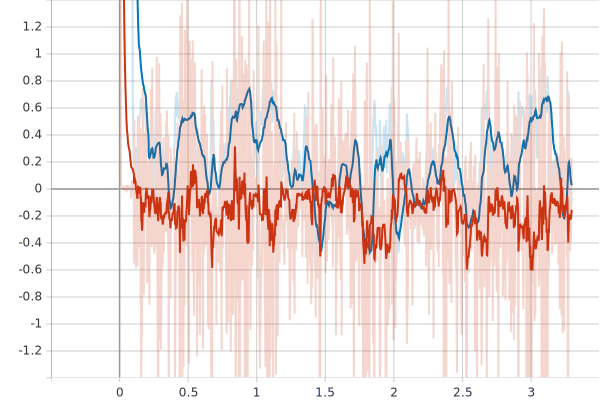
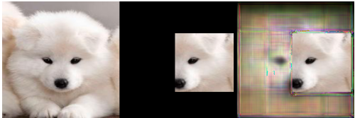

# Pytorch_Outpainting_SRN
This repository rewrites tensorflow implementation of [Wide-Context Semantic Image Extrapolation](http://jiaya.me/papers/imgextrapolation_cvpr19.pdf) paper into PyTorch causally. It refers to the github repository [Jia-Research-Lab/outpainting_srn](https://github.com/Jia-Research-Lab/outpainting_srn), and copies some files `pytorch/{model,util}` from [shepnerd/inpainting_gmcnn](https://github.com/shepnerd/inpainting_gmcnn) to compute `IDMRFLoss` of `VGG19`.

Image from their paper. 
## Description
This repo aims to train both generator and discriminator from scratch, except the pretrained VGG19 model. It only implements part of the tensorflow one, i.e. subpixel convolution, SegmenticRegerenationNet and relative spatial variant mask. <s>Training the model with `VGG19 IDMRFLoss` fails to converge, so I exclude that loss at the current stage. </s>

According to the paper, the training steps are stated as follows,
1. Try pretraining GAN, with settings `pretrain_l1_alpha=5, mrf_alpha=0, gan_loss_alpha=0`
2. Refining SRN, with settings `pretrain_l1_alpha=1.2, mrf_alpha=0.05, gan_loss_alpha=0.001`

## How to run?
1. Download the `cat2dog` dataset, only use `TrainB` folder for model training. 
2. Run the file to initiate the training progress. 
```python
python main.py [--pretrained_network 1][--weightpath None][--img_shapes [256,256,3]]
[--batch_size 4][--epoch 1000][--g_cnum 64][--d_cnum 64][--gan_loss_alpha 0.001]
[--wgan_gp_lambda 10][--pretrain_l1_alpha 1.2][--l1_loss_alpha 4.2]
[--ae_loss_alpha 1.2][--fa_alpha 0.5][--mrf_alpha 0.05][--lrG 1e-4][--lrD 1e-4]
[--lpD 5][--beta1 0.5][--beta2 0.9][--summarydir 'log/store']
```
  * Train GAN first
```python
python main.py --pretrained_network=1 --batch_size=8 --gan_loss_alpha=0 --pretrain_l1_alpha=5
--mrf_alpha=0 --lrG=1e-5 --lrD=5e-5 --beta1 0.5 --beta2 0.9 --summarydir=log/store
```
  * Refine SRN
```python
python main.py --pretrained_network=0 --weightpath=log/store --batch_size=8 
--lrG=1e-5 --lrD=5e-5 --mrf_alpha=0.05 --summarydir=log/store5 --beta1=.5 --beta2=.9 --pretrain_l1_alpha=1.2 
--gan_loss_alpha=0.001 
```
3. Run Tensorboard via, 

<p>Though watching losses of GAN structure is not interesting. </p> 

```
tensorboard --logdir=log/store
```

## Preliminary Result 
- 40 epochs pretrain GAN
 

- Refine SRN
TODO
